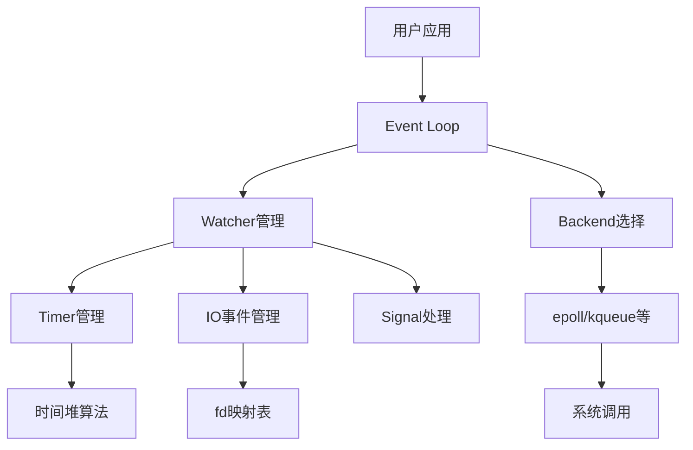
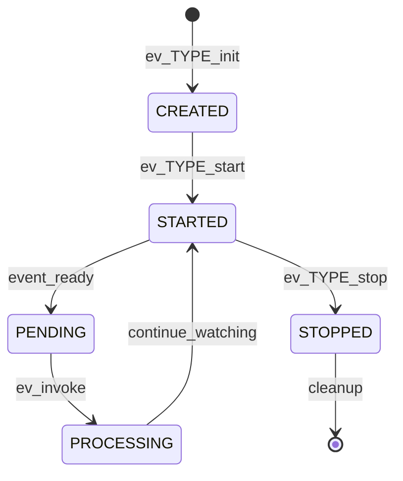
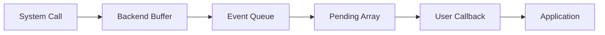

# libev 系统架构设计全景图

## 1. 整体架构概览

### 1.1 分层架构设计
```
┌─────────────────────────────────────────┐
│           Application Layer             │  ← 用户应用程序
├─────────────────────────────────────────┤
│           C/C++ API Layer               │  ← ev.h, ev++.h
├─────────────────────────────────────────┤
│        Event Loop Core Layer            │  ← ev.c 核心逻辑
├─────────────────────────────────────────┤
│        Backend Abstraction Layer        │  ← 多种后端适配
├─────────────────────────────────────────┤
│         Platform Interface Layer        │  ← 系统调用封装
└─────────────────────────────────────────┘
```

### 1.2 核心组件交互图


## 2. 模块详细设计

### 2.1 Event Loop模块

#### 2.1.1 状态机设计
```
INITIALIZED → RUNNING → STOPPING → TERMINATED
     ↓           ↓         ↓          ↓
   配置完成    处理事件   清理资源    循环结束
```

#### 2.1.2 生命周期管理
```c
// 创建阶段
struct ev_loop *loop = ev_loop_new(EVFLAG_AUTO);

// 运行阶段  
ev_run(loop, 0);

// 销毁阶段
ev_loop_destroy(loop);
```

### 2.2 Watcher管理模块

#### 2.2.1 对象生命周期
```
CREATE(init) → START(register) → ACTIVE(process) → STOP(unregister) → DESTROY(cleanup)
```

#### 2.2.2 状态转换图


### 2.3 Backend适配模块

#### 2.3.1 插件式架构
```c
// Backend接口定义
struct ev_backend_ops {
    int (*init)(EV_P_ int flags);
    void (*destroy)(EV_P);
    void (*poll)(EV_P_ ev_tstamp timeout);
    int (*check)(EV_P);
};

// 具体实现注册
static struct ev_backend_ops epoll_backend = {
    .init = epoll_init,
    .destroy = epoll_destroy,
    .poll = epoll_poll,
    .check = epoll_check
};
```

#### 2.3.2 运行时后端选择
```c
// 智能后端选择算法
static int
backend_choose(void)
{
    // 优先级排序: epoll > kqueue > port > poll > select
    if (ev_use_epoll()) return BACKEND_EPOLL;
    if (ev_use_kqueue()) return BACKEND_KQUEUE;
    if (ev_use_port()) return BACKEND_PORT;
    if (ev_use_poll()) return BACKEND_POLL;
    return BACKEND_SELECT;
}
```

## 3. 数据流设计

### 3.1 事件处理流水线
```
事件产生 → 系统通知 → Backend收集 → Loop分发 → Watcher回调 → 用户处理
   ↑                                                    ↓
   └───────────────────── 重新注册  ←─────────────────────┘
```

### 3.2 内存数据流向


## 4. 性能架构设计

### 4.1 零拷贝优化
```c
// 事件数据传递采用引用而非复制
static void
fd_event_nocheck(EV_P_ int fd, int revents)
{
    // 直接传递watcher指针，避免数据复制
    for (w = anfds[fd].head; w; w = w->next) {
        if (w->events & revents) {
            ev_feed_event(EV_A_ (ev_watcher*)w, w->events & revents);
        }
    }
}
```

### 4.2 批量处理机制
```c
// 批量处理pending事件减少函数调用开销
static void
ev_invoke_pending(EV_P)
{
    pendingpri = NUMPRI;
    while (pendingpri) {
        --pendingpri;
        while (pendings[pendingpri]) {
            // 批量处理同一优先级的所有事件
            ANPENDING *p = pendings[pendingpri];
            // ... 处理逻辑
        }
    }
}
```

### 4.3 缓存优化策略
```c
// 时间缓存减少系统调用
VAR(ev_tstamp, now_floor, , , 0.)  // 缓存当前时间
VAR(ev_tstamp, timeout_block, , , 0.)  // 缓存超时计算结果

// 内存局部性优化
VAR(ev_watcher_time*, timerv, [TIMERS], , 0)  // 连续内存存储
VAR(ev_watcher*, pending, [NUMPRI], , 0)      // 优先级分组存储
```

## 5. 并发与同步设计

### 5.1 单线程假设
```c
// 线程局部存储设计
struct ev_loop {
    // 所有字段都是线程私有的
    int backend_fd;        // 每个loop独立的backend
    ev_tstamp now;         // 线程本地时间缓存
    int activecnt;         // 线程本地活跃计数
    // ... 其他字段
};
```

### 5.2 跨线程通信机制
```c
// ev_async实现线程安全唤醒
typedef struct {
    EV_WATCHER(ev_async)
    sig_atomic_t sent;     // 原子操作标志
    int fd;                // 通信管道fd
} ev_async;

// 使用pipe/eventfd实现跨线程通知
static void
async_send(EV_P_ ev_async *w)
{
    if (!w->sent) {
        w->sent = 1;
        write(w->fd, "", 1);  // 触发事件循环
    }
}
```

## 6. 错误处理与恢复机制

### 6.1 多层次验证体系
```c
// 编译时验证
#if EV_VERIFY > 2
# define EV_FREQUENT_CHECK ev_verify(EV_A)
#else
# define EV_FREQUENT_CHECK do { } while (0)
#endif

// 运行时验证
static void
ev_verify(EV_P)
{
    // 数据结构完整性检查
    assert(("libev: loop not initialized", ev_is_active(&pipe_w)));
    assert(("libev: active index mismatch", ev_active(w) == expected_index));
    // ... 更多验证
}
```

### 6.2 优雅降级机制
```c
// Backend故障转移
static void
backend_fallback(EV_P)
{
    // 当前backend失效时的处理
    if (backend_fd < 0) {
        // 尝试下一个可用backend
        switch (current_backend) {
            case BACKEND_EPOLL:
                current_backend = BACKEND_KQUEUE;
                break;
            case BACKEND_KQUEUE:
                current_backend = BACKEND_POLL;
                break;
            // ... 其他降级路径
        }
    }
}
```

## 7. 内存管理架构

### 7.1 分层内存管理
```
┌─────────────────────────────────────┐
│         Application Memory          │ ← 用户分配
├─────────────────────────────────────┤
│        Watcher Object Pool          │ ← 预分配对象池
├─────────────────────────────────────┤
│        Backend Internal Buffers     │ ← 系统调用缓冲区
├─────────────────────────────────────┤
│        Loop Control Structures      │ ← 核心控制结构
└─────────────────────────────────────┘
```

### 7.2 内存回收策略
```c
// 惰性回收机制
static void
memory_cleanup(EV_P)
{
    // 定期清理不再使用的内存
    if (++cleanup_counter > CLEANUP_THRESHOLD) {
        cleanup_counter = 0;
        // 回收空闲的fd_change数组
        // 压缩pending队列
        // 释放未使用的backend资源
    }
}
```

## 8. 可扩展性设计

### 8.1 插件化Watcher扩展
```c
// 新类型Watcher注册机制
typedef struct {
    const char *name;
    size_t size;
    void (*init)(EV_P_ ev_watcher *w);
    void (*start)(EV_P_ ev_watcher *w);
    void (*stop)(EV_P_ ev_watcher *w);
} ev_watcher_type;

// 动态注册新类型
int ev_register_watcher_type(ev_watcher_type *type) {
    // 添加到类型注册表
    // 初始化相关数据结构
    return 0;
}
```

### 8.2 自定义Backend支持
```c
// Backend插件接口
typedef struct {
    const char *name;
    int (*probe)(void);                    // 可用性探测
    int (*init)(EV_P_ int flags);          // 初始化
    void (*destroy)(EV_P);                 // 销毁
    void (*poll)(EV_P_ ev_tstamp timeout); // 事件轮询
    int (*ctl)(EV_P_ int op, ev_watcher *w); // 控制操作
} ev_backend_plugin;

// 注册自定义backend
int ev_register_backend(ev_backend_plugin *plugin) {
    // 添加到backend候选列表
    // 设置优先级
    return 0;
}
```

## 9. 监控与调试架构

### 9.1 性能监控体系
```c
// 性能统计收集
#if EV_STATS
VAR(unsigned long, invoke_calls, , , 0)      // 回调调用次数
VAR(unsigned long, loop_count, , , 0)        // 循环迭代次数
VAR(ev_tstamp, loop_time, , , 0.)            // 总运行时间
VAR(ev_tstamp, timeout_block, , , 0.)        // 阻塞时间
#endif

// 实时性能查询API
ev_tstamp ev_loop_time(EV_P) {
    return loop_time;
}

unsigned long ev_loop_invoke_count(EV_P) {
    return invoke_calls;
}
```

### 9.2 调试诊断工具
```c
// 调试信息输出
typedef struct {
    FILE *log_file;
    int log_level;
    unsigned long flags;
} ev_debug_config;

// 调试钩子系统
typedef struct {
    void (*loop_enter)(EV_P);
    void (*loop_leave)(EV_P);
    void (*watcher_start)(EV_P_ ev_watcher *w);
    void (*watcher_stop)(EV_P_ ev_watcher *w);
    void (*event_dispatch)(EV_P_ ev_watcher *w, int revents);
} ev_debug_hooks;
```

## 10. 部署与运维架构

### 10.1 配置管理系统
```c
// 运行时配置
typedef struct {
    unsigned int flags;           // 运行标志
    int backend;                  // 指定backend
    ev_tstamp timeout_max;        // 最大超时时间
    int fd_limit;                 // fd限制
    size_t memory_limit;          // 内存限制
} ev_config;

// 环境变量配置支持
static void
config_from_env(ev_config *cfg)
{
    const char *env;
    
    if ((env = getenv("LIBEV_FLAGS")))
        cfg->flags = strtoul(env, 0, 0);
        
    if ((env = getenv("LIBEV_BACKEND")))
        cfg->backend = atoi(env);
        
    if ((env = getenv("LIBEV_TIMEOUT_MAX")))
        cfg->timeout_max = atof(env);
}
```

### 10.2 版本兼容性管理
```c
// ABI/API版本管理
#define EV_VERSION_MAJOR 4
#define EV_VERSION_MINOR 33
#define EV_VERSION_PATCH 0

// 特性检测宏
#if EV_VERSION_MAJOR >= 4
# define EV_FEATURE_BACKEND_DYNAMIC 1
# define EV_FEATURE_WATCHER_EXTEND 1
#endif

// 兼容性层
#if EV_COMPAT3
// 保持与3.x版本的API兼容
#endif
```

## 11. 安全架构设计

### 11.1 内存安全防护
```c
// 边界检查
static inline void
safe_array_access(void *array, size_t element_size, int index, int max_elements)
{
    assert(("libev: array index out of bounds", index >= 0 && index < max_elements));
    return (char*)array + index * element_size;
}

// 指针有效性验证
static inline int
validate_watcher_pointer(ev_watcher *w)
{
    return w && 
           ((uintptr_t)w & (sizeof(void*)-1)) == 0 &&  // 对齐检查
           w->active >= 0 && w->active < MAX_ACTIVE_VALUE;  // 值域检查
}
```

### 11.2 资源泄漏防护
```c
// RAII风格资源管理
typedef struct {
    ev_loop *loop;
    int owns_loop;  // 标记是否需要销毁loop
} ev_scope_guard;

static inline ev_scope_guard
ev_make_scope_guard(ev_loop *loop, int owns_loop)
{
    ev_scope_guard guard = { loop, owns_loop };
    return guard;
}

static inline void
ev_scope_guard_cleanup(ev_scope_guard *guard)
{
    if (guard->owns_loop && guard->loop) {
        ev_loop_destroy(guard->loop);
        guard->loop = NULL;
    }
}
```

---
**架构版本**: v2.0  
**设计原则**: 高性能、高可用、易扩展  
**适用场景**: 高并发网络服务、实时系统、嵌入式应用  
